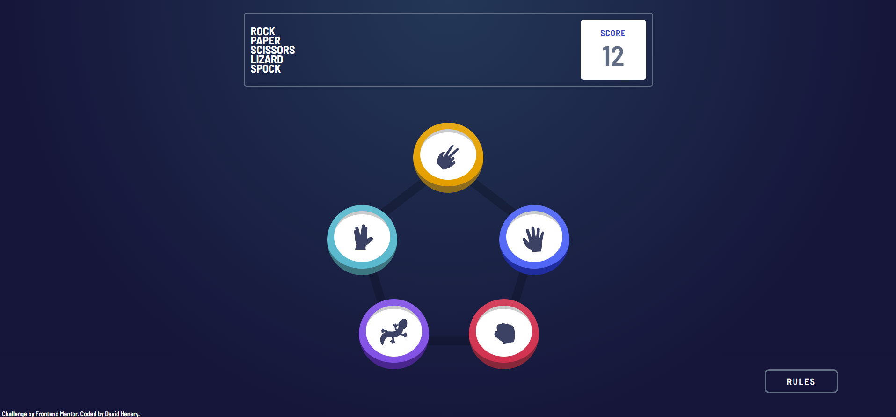

# Frontend Mentor - Rock, Paper, Scissors solution

This is a solution to the [Rock, Paper, Scissors challenge on Frontend Mentor](https://www.frontendmentor.io/challenges/rock-paper-scissors-game-pTgwgvgH). Frontend Mentor challenges helps improve coding skills by building realistic projects. 

## Table of contents

- [Overview](#overview)
  - [The challenge](#the-challenge)
  - [Screenshot](#screenshot)
  - [Links](#links)
- [My process](#my-process)
  - [Built with](#built-with)
  - [What I learned](#what-i-learned)
  - [Continued development](#continued-development)
  - [Useful resources](#useful-resources)
- [Author](#author)


## Overview

### The challenge

Users should be able to:

- View the optimal layout for the game depending on their device's screen size.

- Play Rock, Paper, Scissors, Lizard, Spock against the computer.

- Maintain the state of the score after refreshing the browser.

### Screenshot



### Links

- Solution URL: [Solution on frontend mentor](https://www.frontendmentor.io/solutions/rockpaperscissorslizardspock-cssgrid-react-reduxtoolkit-ARyACNP_dh)
- Live Site URL: [Rock-Paper-Scissors-Lizard-Spock](https://rock-papel-scissors-lizard-spock.netlify.app)

## My process

### Built with

- Semantic HTML5 markup
- Flexbox
- CSS Grid
- Mobile-first workflow
- [SASS](https://sass-lang.com) 
- SASS Variables & Mixins
- [React](https://reactjs.org) - JS library
- [React Redux Toolkit](https://redux-toolkit.js.org) - State management

### What I learned

I one of the main things this challenge did was to test my CSS grid skills especially when it came to positioning the icons on the menu correctly. Initially it was a bit awkward, but it definitely helped me to understand and use the grid a little bit better.

In this project, i also learned about non-serializable values in redux state. I stumbled across this when i tried to store the SVG components for the different icons in the state object. This gave me the error "a non-serializable value was detected in the state". When i researched more into this issue i found out that it's not usually a good idea to store these values in the state, but there are sometimes exeptions, and that the error actually occurs in the redux store.

Non-serializable values are: 
 - Promises,
 - Symbols,
 - Maps/Sets, 
 - functions 

In my case the SVG component was stored as a symbol and in the store we can controll wether or not to accept serialized values in the state, though changing different values in the middleware property in the store and turn off the serialization check. We can do this for specific items or for the whole store. 

Even though it is not advised to do this, especially in larger projects, i felt this was the best way to implement the SVG Components in the context of this project, so i turned off the serialization check via the middleware in the store.

I done this because it's a small project and wouldn't have any impact on the overall application.

```js
export const store = configureStore({
    reducer: {
        modal: modalReducer,
        game: gameReducer,
    },
    middleware: (getDefaultMiddleware) => {
// Can make serialization more specific
        return getDefaultMiddleware({
            serializableCheck: false,
        })
    }
})
```

### Continued development

When i was adding the circle styling around the winners icon at the end of the game, i implemented them using seperate empty divs and styled them with different opacity for each ring to create the effect. 

I first tried to implement the styling though a css radial gradient, and i was unable to create the desired style though this. Although when i was researching into different gradient styles, i was inspired by all the different ways gradients can be used and the unique things they can be used to create and not just gradients but also css backgrounds with different blend modes, which also can used with gradients to make some pretty creative styles. I will definitely be using these different techniques in future projects.

<br>

### Useful resources

Here are some of the different resources i found that helped me understand the non-serialization problem i was having with storing the SVG components in the state and also some resources that inspired me about different gradients : 

### Redux Resources

- [Redux.js](https://redux.js.org/style-guide/#do-not-put-non-serializable-values-in-state-or-actions) - Documentation that went into more detail about non-serialization and the behaviour of the state.

- [redux-toolkit.js](https://redux-toolkit.js.org/usage/usage-guide#working-with-non-serializable-data) - Similar to the above documentation but more specific to redux-toolkit.

### Gradient & Blend Resources

- [cssgradient.io](https://cssgradient.io) - CSS gradient generater that also contains many blog articles about gradients.

- [smashing magazine](https://www.smashingmagazine.com/2022/01/css-radial-conic-gradient) - An article on different types of gradients and their use cases.

- [Logrocket - Advanced effects with css blend mode](https://blog.logrocket.com/advanced-effects-with-css-background-blend-modes-4b750198522a) - An article about all the types of things you can create with blend mode (As well as using them with gradients)

## Author

- Website - [David Henery](https://www.djhwebdevelopment.com)
- Frontend Mentor - [@David-Henery4](https://www.frontendmentor.io/profile/David-Henery4)

